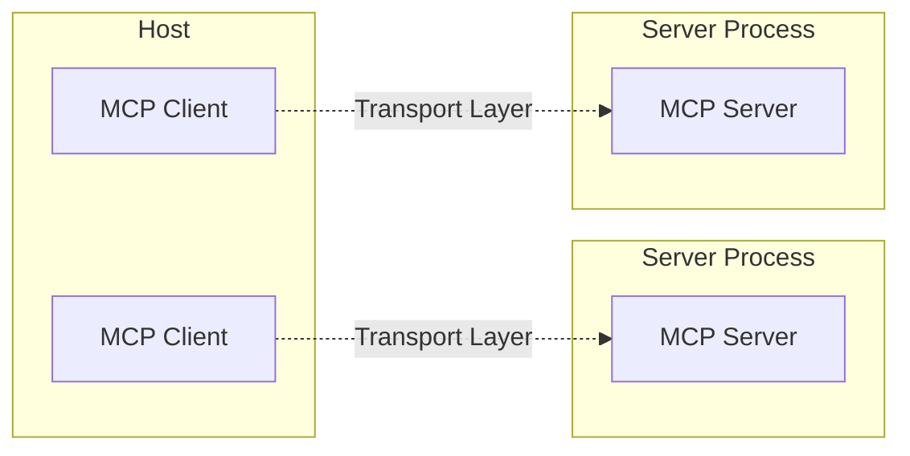

## MCP(Model Context Protocol)란?

2024년 11월 AI 춘추전국 시대에, Anthropic에서 발표한 오픈 소스 표준[^1]. AI 도구들이 서로 소통하는 표준이다. AI계의 USB-C라고도 설명하는데[^2], 여럿이 공유하는 **소통방식**을 의미하기 때문이다.   
혹자는 플러그인이나 확장 프로그램(Extension)에 비유하기도 하는데, 제 3자가 개발한 코드를 부가적으로 활용한다는 점에선 같지만 플러그인이나 확장 프로그램은 메인 프로그램 내부에 직접 코드가 설치되는데 비해 MCP는 별도 프로세스로 실행된다는 점에서 일부 차이가 있다.
단 MCP를 설치한다거나, 추천한다고 할 때는 이 표준 자체를 의미하는 것이 아니라, 그 구현체들을 얘기하는 것이다. "확장 프로그램(extension)이 뭐냐"와 "어떤 확장 프로그램을 추천하는가"의 차이점과 같다.   


### MCP의 아키텍처

MCP는 기본적으로 클라이언트-서버 아키텍처를 따른다.

- **호스트**: 커서, 클로드 데스크톱 같은 LLM 애플리케이션. 연결을 시작하는 주체.
- **클라이언트**: 호스트 내에서 MCP 소통을 담당하는 코드 모듈.
- **서버**: 클라이언트에게 컨텍스트, 데이터, 기능을 제공하는 코드 모듈.


(출처: [아키텍처 개요 - MCP Docs](https://modelcontextprotocol.io/docs/concepts/architecture#overview))

## 서버의 위치

MCP는 기본적으로 로컬 실행을 전제로 설계되었다. 클로드 웹앱이 아니라 데스크탑 앱이 필요한 이유도 이 때문이다.
MCP 문서에서도 로컬 컴퓨터 내에서 모든 아키텍쳐가 돌아가는 걸 전제로 하고 있고,[^3] 퀵스타트 가이드에서도 파일 시스템 MCP 서버를 `npx @modelcontextprotocol/server-filesystem`로 로컬에서 실행하는 방식으로 설명되어 있다.[^4]
특히 사용하려는 (파일시스템, 피그마 등) MCP 서버들이 각각 로컬에서 실행되어야 하는데, 이를 위해서는 두 가지 방식이 있다.

1. npm 패키지 직접 설치 후 실행
2. npx로 바로 실행 (설치 없이)

| 실행 방식 | 설치 여부 | 특징 |
|-----------|-----------|------|
| **패키지 설치 후 실행** | ✅ 영구 설치 | 고정 버전, 빠른 시작 |
| **npx로 바로 실행** | ❌ 설치 없이 | 항상 최신, 캐시 활용 |

캐싱하기 때문에 npx 방식도 제일 처음 실행 외에는 속도 차이가 크게 나지는 않는다.
기본적으로는 npx를 활용하고, 보안 등의 이유로 버전에 민감한 MCP만 직접 설치하는 방식을 추천한다.

## Smithery란?

MCP 서버들의 **중앙 레지스트리**다. JavaScript 패키지들의 npm 같은 존재라고 할 수 있다.   
패키지별 상세 페이지에 가면, 위에서 언급한 npm / npx 방식에 따른 실행방법도 제공한다. npx 방식을 활용하려면 JSON 탭을 누른 뒤 해당 내용을 각 호스트의 JSON 설정에 붙여넣으면 된다.

### Smithery CLI의 한계

Smithery는 `@smithery/cli`라는 별도 CLI 도구도 제공한다. 이론적으로는 다음과 같이 사용할 수 있다:

```bash
# MCP 서버 실행
npx @smithery/cli run mcp-server-name --config "{}"
```

하지만 실제로 사용해보면 몇 가지 문제가 있다:

1. **호스트 지원 부족**: Cursor나 Claude Desktop 등 주요 MCP 호스트들이 이 방식을 완전히 지원하지 않는다.
2. **설정 복잡성**: CLI 방식보다는 직접 npm/npx 방식이 더 직관적이다.
3. **문서 부족**: 공식 MCP 서버들도 대부분 직접 설치 방식을 권장한다.

### 실제 경험: cursor-talk-to-figma MCP 설정 실패

실제로 cursor-talk-to-figma MCP를 설정할 때 Smithery 방식으로는 연결이 되지 않았다. Smithery에서 제안하는 `@smithery/cli run` 방식을 적용해도 Cursor에서 MCP 서버를 인식하지 못했고, 여러 시행착오 끝에 공식 문서의 직접 설치 방식으로만 해결할 수 있었다.

결국 다음과 같은 전통적인 방식이 가장 안정적이었다:

```json
{
  "mcpServers": {
    "TalkToFigma": {
      "command": "bunx",
      "args": ["cursor-talk-to-figma-mcp@latest"]
    }
  }
}
```

Smithery CLI는 아직 실험적인 단계이고, 실제 환경에서는 여전히 개별 MCP 서버의 공식 문서를 따르는 것이 가장 확실하다. 자세한 설정 과정과 문제 해결 방법은 [Cursor Talk to Figma MCP 연결하기](/cursor-figma-mcp-guide/)에서 다뤘다.

### 흔한 오해: Smithery가 "클라우드 실행"을 해준다?

처음 MCP를 접했을 때 가장 큰 의문은 "매번 서버를 로컬에 설치해야 하나?"였다. 
그래서 Smithery를 발견했을 때 "클라우드에서 실행해주는 서비스"라고 생각했다. AI들의 잘못된 안내도 한몫했다.

하지만 실제로는, Smithery는 npm과 마찬가지로 레지스트리 역할을 할 뿐이다. 다만 npm보다는 기능이 제한적이다:

| 기능 | npm | Smithery |
|------|-----|----------|
| **패키지 검색** | ✅ | ✅ |
| **직접 설치** | ✅ `npm install` | ❌ |
| **의존성 관리** | ✅ | ❌ |
| **버전 관리** | ✅ | 제한적 |
| **문서화** | README 원본 | 추상화된 탭 |

## 결론

Smithery는 MCP 서버를 발견하고 설치 방법을 확인하는 용도로는 유용하다. 하지만 실제 사용에서는 다음을 권장한다:

1. **Smithery에서 서버 발견**: 원하는 MCP 서버를 찾는다.
2. **공식 문서 확인**: GitHub 저장소나 공식 문서에서 정확한 설치 방법을 확인한다.
3. **직접 설치**: npm/npx를 활용해 직접 설치하고 설정한다.

Smithery CLI는 아직 실험적인 단계이고, 주요 MCP 호스트들이 완전히 지원하지 않으므로 당분간은 전통적인 방식을 사용하는 것이 안전하다.

---

[^1]: [Introducing the Model Context Protocol - Anthropic](https://www.anthropic.com/news/model-context-protocol)
[^2]: [Introduction - MCP Docs](https://modelcontextprotocol.io/introduction)
[^3]: [General Architecture - MCP Docs](https://modelcontextprotocol.io/introduction#general-architecture)
[^4]: [Quickstart - MCP Docs](https://modelcontextprotocol.io/quickstart/user)
